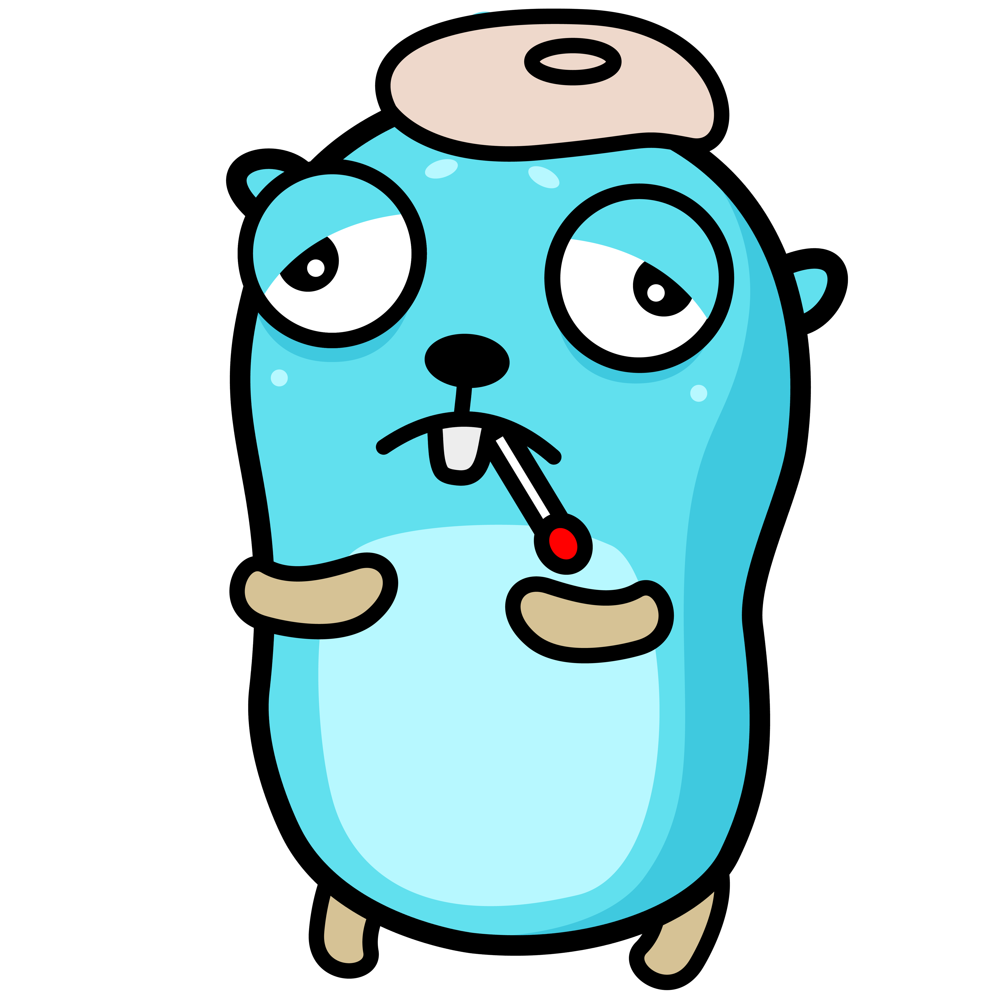
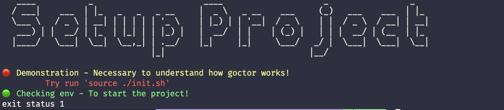

# Goctor

> THIS PROJECT IS UNDER **DEVELOPMENT**. THIS IS **NOT READY** TO BE USED.

<div style="width:100%; display: flex; justify-content: center;">
    
</div>

The purposal is standarize how we setup the environment for any kinda of project. Why?

- Facilitate a new dev inside the project.
- Facilitate give tech support for the project.
- Avoid the necessity to onboarding session just to configure the project.
- Avoid put texts and texts inside the readme only for the setup.

## Setup

Install using:

```sh
...
```

Create a yml file inside your project:

```yml
version: "1"
banner:
    title: Setup Project
exams:
    - name: Demonstration
      description: Necessary to understand how goctor works!
      run: echo "goctor::ANY_ISSUE"
      possibilities:
            - goctorcode: ANY_ISSUE
              message: Try run 'source ./init.sh'
    - name: Checking env
      description: To start the project!
      run: exit 0
      possibilities:
            - code: 1
              message: Try run this command...
```

Run: `goctor -f ./example/goctor.yml`



## Inpiration

The mainly inspiration: https://docs.flutter.dev/get-started/install/windows#run-flutter-doctor
I only used Flutter one time and i felt in love with the flutter doctor.
